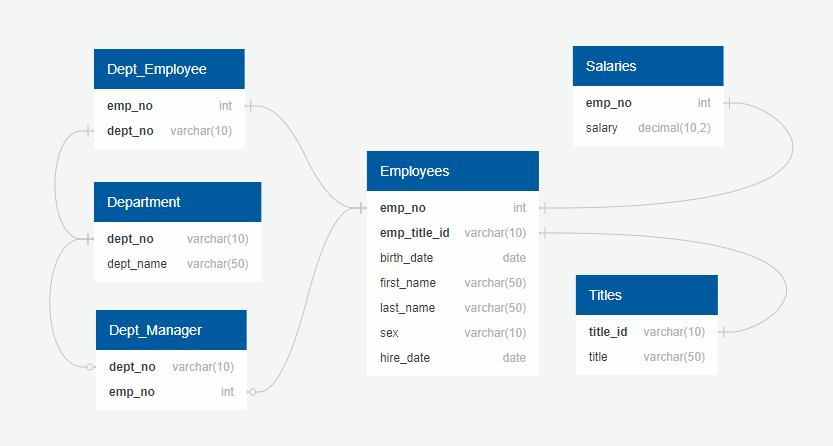

# Module 9 - SQL Challenge
## Data Modeling

## Data Engineering
- [Table Schemas](/EmployeeSQL/table%20schemas)
  - [Schema_1_department](/EmployeeSQL/table%20schemas/Schema_1_department.sql)
  - [Schema_2_titles](/EmployeeSQL/table%20schemas/Schema_2_titles.sql)
  - [Schema_3_employees](/EmployeeSQL/table%20schemas/Schema_3_employees.sql)
  - [Schema_4_salaries](/EmployeeSQL/table%20schemas/Schema_4_salaries.sql)
  - [Schema_5_dept_employee](/EmployeeSQL/table%20schemas/Schema_5_dept_employee.sql)
  - [Schema_6_ dept_manager](/EmployeeSQL/table%20schemas/Schema_6_dept_manager.sql)
- [ERD Tool Text](/EmployeeSQL/QuickDBD_erd_text.txt)
## Data Analysis

- [Queries](/EmployeeSQL/queries)
  - [DA8_Employee_Last_Name_Freq](/EmployeeSQL/queries/DA8_Employee_Last_Name_Freq.sql)
  - [DA8_Employee_Last_Name_Freq](/EmployeeSQL/queries/DA8_Employee_Last_Name_Freq.sql)
  - [DA8_Employee_Last_Name_Freq](/EmployeeSQL/queries/DA8_Employee_Last_Name_Freq.sql)
  - [DA8_Employee_Last_Name_Freq](/EmployeeSQL/queries/DA8_Employee_Last_Name_Freq.sql)
  - [DA8_Employee_Last_Name_Freq](/EmployeeSQL/queries/DA8_Employee_Last_Name_Freq.sql)
  - [DA8_Employee_Last_Name_Freq](/EmployeeSQL/queries/DA8_Employee_Last_Name_Freq.sql)
  - [DA8_Employee_Last_Name_Freq](/EmployeeSQL/queries/DA8_Employee_Last_Name_Freq.sql)
  - [DA8_Employee_Last_Name_Freq](/EmployeeSQL/queries/DA8_Employee_Last_Name_Freq.sql)
## Bonus
